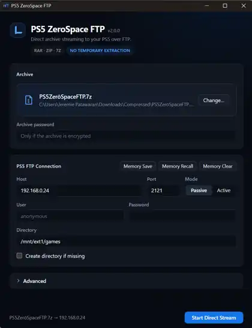
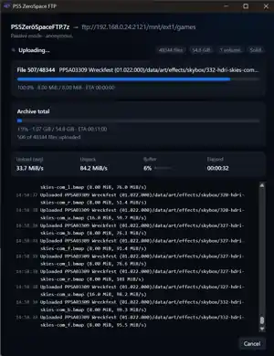

# PS5 ZeroSpace FTP

**Stream RAR, ZIP and 7z archives directly to your PS5 over FTP — without creating a full temporary extracted copy first.**

PS5 ZeroSpace FTP is a Windows-focused personal fork of `zsftp` built around a simple problem: large game archives can require a huge amount of extra free disk space if you extract them before transferring them. This fork decompresses files on the fly and feeds them directly into the FTP upload through a bounded memory buffer.

> **RAR · ZIP · 7Z** · **Direct archive → FTP streaming** · **No full temporary extraction**

## Screenshots

<table>
<tr>
<td width="50%" valign="top"></td>
<td width="50%" valign="top"></td>
</tr>
<tr>
<td align="center"><b>Windows GUI</b></td>
<td align="center"><b>Live 7z → PS5 FTP transfer</b></td>
</tr>
</table>

## Why ZeroSpace?

Normally you extract a large archive first and upload it afterward. That can require roughly the full unpacked size again as free local disk space. PS5 ZeroSpace FTP instead uses:

```
RAR / ZIP / 7z → decompressor → bounded memory buffer → FTP → PS5
```

- **No full temporary extracted copy** — files are streamed instead of unpacked into a second folder.
- **RAR, ZIP and 7z support** — RAR uses UnRAR; ZIP and 7z use libarchive.
- **Decompression + upload overlap** — the CPU can unpack while the network uploads.
- **Windows Unicode paths** — ZIP/7z archive paths use the Windows wide-character API, including names such as `Tōkon`.
- **Transfer dashboard** — current file, total progress, ETA, upload/unpack speed, buffer usage and live log.
- **PS5-oriented FTP setup** — host, port, passive/active mode and destination directory in the desktop GUI.
- **Skip matching remote files** — reruns can avoid re-sending files already present with the same size.

> The name **ZeroSpace** refers to avoiding the extra disk space normally needed for a complete temporary extraction. The app still uses a bounded memory buffer while streaming.

## Windows desktop app

The Windows GUI is the primary supported desktop build. Choose a `.rar`, `.zip` or `.7z`, enter your PS5 FTP connection details, then select **Start Direct Stream**.

The app includes archive-password handling, saved FTP settings, advanced buffer controls, cancellation, progress/ETA reporting, and a live transfer log.

### Windows installation

1. Download the latest Windows x64 GUI build from this repository's **Releases** page.
2. Extract it into its own folder.
3. Keep `zsftp-gui.exe` and `zsftpcore.dll` together.
4. Run `zsftp-gui.exe`.

The executable is currently not code-signed, so Windows SmartScreen may show a warning on first launch.

## Command line (zsftp)

```bash
zsftp --file archive.7z --host ftp.example.com --port 21 --mode passive \
       --user username --password "password" --directory "/destination/dir"
```

Multi-volume and password-protected archives are supported:

```bash
--archive-password "*[open sesame]*"
```

| Option | Description |
|---|---|
| `--file PATH` | RAR, ZIP or 7z archive. For multi-volume RAR sets, use the first volume (`.part1.rar`, `.rar`). |
| `--host HOST` | FTP server name or address (IPv4 or IPv6). |
| `--port PORT` | Default `21`. |
| `--mode passive\|active` | Data connection mode. Default `passive`. |
| `--user NAME` | Without it, the login is anonymous. |
| `--password PASSWORD` | Requires `--user`. If omitted, it is asked for (hidden) on the terminal. |
| `--directory DIR` | Destination, absolute or relative to the login directory. Without it the login directory is used and a warning says which one. |
| `--mkdir` | Create the destination if it does not exist, with a single `MKD` (not recursive). Without it, a missing destination is an error. |
| `--archive-password PASSWORD` | For encrypted RAR/ZIP archives; asked for on the terminal when needed. `--rar-password` remains an alias. |
| `--no-tui` | Plain log output instead of the full-screen interface (automatic when not on a terminal). |
| `--verbose` | Log every FTP command and reply (the password is masked). |
| `--buffer MIB` | Memory buffer between decompression and upload. Default `64`. |

The interface shows a fixed log panel, the progress of the current file and of
the whole archive with their ETAs, the upload and decompression speeds, and
how full the buffer is (full: the network is the bottleneck; empty: the CPU
is). **Cancel** with `q`, `Esc` or `Ctrl-C` (or `SIGINT`/`SIGTERM` in plain
mode).

Exit codes: `0` success, `1` error, `2` invalid command line, `130` cancelled.

### Install the command line

| Platform | Asset |
|---|---|
| Windows (x64) | `zsftp-windows-x64.rar` |
| Linux (x64, glibc 2.35+) | `zsftp-linux-x64.rar` |
| Linux (arm64, glibc 2.35+) | `zsftp-linux-arm64.rar` |

Each archive holds the `zsftp` executable, `LICENSE`, `README.md` and
`THIRD_PARTY_NOTICES.md`. The executables are statically linked and need no
other installation.

#### Windows

1. Extract `zsftp-windows-x64.rar` into `C:\zsftp`, so that the
   result is `C:\zsftp\zsftp.exe`.

2. Run it from a terminal:

   ```powershell
   C:\zsftp\zsftp.exe --version
   ```

The binary is not code-signed, so if it does not start at all, check whether
your antivirus quarantined it.

#### Linux

```bash
unrar x zsftp-linux-x64.rar zsftp/        # or: 7z x -orarftp zsftp-linux-x64.rar
sudo install -m 755 zsftp/zsftp /usr/local/bin/zsftp
zsftp --version
```

Without root, install it into a directory in your `PATH` instead, for example
`install -D -m 755 zsftp/zsftp ~/.local/bin/zsftp`. The binary is built on
Ubuntu 22.04, so it runs on distributions with glibc 2.35 or newer; libstdc++
is linked statically.

## How it works

```
 extractor thread                         uploader thread
 UnRAR / libarchive ──(1 MiB blocks)──▶ [ bounded buffer ] ──▶ libcurl STOR
 (checks CRC/BLAKE2)                                         (one control connection)
```

RAR uses UnRAR's test mode; ZIP and 7z use libarchive's streaming reader. In all cases the decompressed data goes directly into the bounded buffer, which the FTP upload drains, without creating extracted files. A file only counts as uploaded after UnRAR confirmed its
checksum; on any error the incomplete remote file is deleted.

The command line links this engine statically. The app uses it through a
shared library (`libzsftpcore`, C API in `src/capi/zsftp.h`).

Behaviour, in both:

- **Files already on the server** with the same size are skipped; with a
  different size they are overwritten. Re-running after a failure only sends
  what is missing or incomplete.
- **Directories** of the archive, including empty ones, are created.
- **Modification times** are preserved with `MFMT` (or vsftpd's `MDTM` form)
  when the server allows it.
- **RAR** keeps UnRAR's multi-volume, solid and encrypted archive support.
- **ZIP** is streamed with libarchive, including encrypted ZIP when the platform libarchive has crypto support.
- **7z** is streamed with libarchive. Encrypted 7z payloads are not supported by libarchive and are rejected before upload.
- **Paths are sanitized** like UnRAR does: `..` components, absolute paths and
  control characters never escape the destination directory.
- **Fail-fast**: a checksum error, a missing volume or a network failure stops
  the transfer and removes the incomplete remote file.

### Not supported yet

FTPS, resuming or retrying a file after a network failure, extracting only
some files, and several parallel connections. Symbolic links, hard links and
file references (`rar -oi`) are skipped with a warning, since FTP cannot
create links.

## Building

Requirements: a C++17 compiler, CMake 3.21+, libarchive 3.4+, and libcurl (the system one is
used when present; otherwise, or with `-DRARFTP_BUNDLED_CURL=ON`, an FTP-only
libcurl is built from source). The other libraries are fetched by CMake.

The UnRAR sources are not part of this repository (they have their own
license) and must be extracted into `unrarsrc/`:

```bash
curl -LO https://www.rarlab.com/rar/unrarsrc-7.3.1.tar.gz
mkdir unrarsrc && tar -xzf unrarsrc-7.3.1.tar.gz -C unrarsrc --strip-components=1
```

### Command line

```bash
cmake -S . -B build -G Ninja -DCMAKE_BUILD_TYPE=Release
cmake --build build
```

The binary is `build/zsftp`. UnRAR is always linked statically into it.

### Desktop app

Besides the above, install Rust ([rustup](https://rustup.rs)) and the Tauri
CLI:

```bash
cargo install tauri-cli --version "^2" --locked
```

From the repository root, build the shared library, then the app:

```bash
cmake -S . -B build -G Ninja -DCMAKE_BUILD_TYPE=Release -DRARFTP_BUILD_LIBRARY=ON
cmake --build build

cd gui
cargo tauri build     # macOS: src-tauri/target/release/bundle/macos/zsftp-gui.app
cargo tauri dev       # or: run the app without bundling it
```

The library is `build/libzsftpcore.so` on Linux and `zsftpcore.dll` on Windows. UnRAR and {fmt} are linked statically into it, and it exports only the
`rarftp_*` functions of `src/capi/zsftp.h`; the `zsftp` executable does not use
it. Add `-DRARFTP_BUNDLED_CURL=ON` to link libcurl statically too, which makes
the library self-contained instead of relying on the system's libcurl.

On Linux `cargo tauri build` makes an AppImage; on Windows use
`cargo tauri build --no-bundle` and keep `zsftpcore.dll` next to
`src-tauri/target/release/zsftp-gui.exe` (the build copies it there). Linux
needs the WebKitGTK development packages that Tauri documents in its
[prerequisites](https://v2.tauri.app/start/prerequisites/#linux); on
Debian/Ubuntu, for example:

```bash
sudo apt install libwebkit2gtk-4.1-dev build-essential curl wget file libxdo-dev libssl-dev \
                 libayatana-appindicator3-dev librsvg2-dev
```

The Rust build looks for the library in `build/` (and `build/Release`); set
`RARFTP_LIB_DIR` to the directory that holds it to use another build directory.
The bundling settings (`gui/src-tauri/tauri.<os>.conf.json`) also name the
library under `../../build/`, so with another directory override that path too,
with the Tauri CLI's `--config` (a JSON merge into its configuration, handed to
the build script as well). On macOS:

```bash
RARFTP_LIB_DIR=/path/to/dir cargo tauri build \
    --config '{"bundle":{"macOS":{"frameworks":["/path/to/dir/libzsftpcore.dylib"]}}}'
```

A macOS app built from source is signed ad hoc, not notarized, so Gatekeeper
blocks it once it has been copied to another Mac. Remove the quarantine
attribute there to open it:

```bash
xattr -dr com.apple.quarantine zsftp-gui.app
```

### Continuous integration

The GitHub Actions workflow (`.github/workflows/ci.yml`) builds and tests Linux (x64 and arm64) and Windows (x64). macOS builds are intentionally not supported. Windows x64 is the primary GUI target.

## Testing

Unit tests:

```bash
ctest --test-dir build --output-on-failure
```

End-to-end tests upload archives created with RARLAB's `rar` to vsftpd running
in Docker ([delfer/alpine-ftp-server](https://hub.docker.com/r/delfer/alpine-ftp-server))
and compare what arrives, byte by byte. They need Docker, `rar` and Python 3.9+
(standard library only):

```bash
python3 tests/integration/run.py --zsftp build/zsftp --rar /path/to/rar
```

`--big` adds a 4.5 GiB file. Active mode is only tested on Linux, where the
container address is reachable directly; Docker Desktop only publishes ports.

With the library built (`-DRARFTP_BUILD_LIBRARY=ON`), `ctest` also runs a
smoke test of its C API, and `--lib` adds tests that drive the library the way
the app does (through its C API, with `ctypes`): uploads, re-runs, multi-volume
and encrypted archives, the password prompt, errors and cancelling. They are
named `lib_*`:

```bash
python3 tests/integration/run.py --zsftp build/zsftp --rar /path/to/rar \
        --lib build/libzsftpcore.dylib -k lib_
```

The Rust side has its own unit tests, which link the built library:
`cargo test --manifest-path gui/src-tauri/Cargo.toml`.

## Libraries

| Library | Use | License |
|---|---|---|
| [UnRAR](https://www.rarlab.com/rar_add.htm) | RAR decompression | UnRAR license (freeware) |
| [libcurl](https://curl.se/libcurl/) | FTP client | curl (MIT/X derivative) |
| [FTXUI](https://github.com/ArthurSonzogni/FTXUI) | Terminal interface (command line only) | MIT |
| [CLI11](https://github.com/CLIUtils/CLI11) | Command line parsing (command line only) | BSD-3-Clause |
| [{fmt}](https://github.com/fmtlib/fmt) | Formatting | MIT |
| [doctest](https://github.com/doctest/doctest) | Unit tests | MIT |
| [Tauri](https://tauri.app) | Desktop app (app only), with its Rust dependencies | MIT or Apache-2.0 |

## Credits and project status

**PS5 ZeroSpace FTP is a personal fork/derivative of the original `rarftp` project by Rui Nelson.** Full credit for the original project and its foundation belongs to Rui Nelson and the original contributors. This project is not presented as the original author's work, an official successor, or an official PS5/Sony application.

The fork exists to adapt the tool for a personal PS5-oriented workflow, including ZIP/7z support and direct archive-to-FTP streaming. It is intended to respect the original project's authorship and MIT license, not to replace, impersonate, or claim ownership of the original project. The original copyright and license notices are retained as required by the MIT license.

Special thanks to **u/portus387 on Reddit** for their contribution/support around the PS5 workflow.

## License

This project is licensed under the MIT license (see `LICENSE`). Binaries also
contain UnRAR, whose license allows free use in any software handling RAR
archives but forbids using its code to re-create the RAR compression
algorithm; see `THIRD_PARTY_NOTICES.md`, which also covers what only the app
contains (Tauri and its Rust dependencies).
